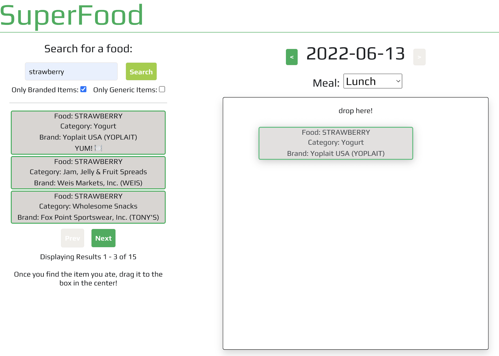

   <h1>:apple: SuperFood :leafy_green:</h1>
   <h3>You are what you eat... so why not keep track?</h3>
   <h5>Tom Gordon</h5>
   <a href='https://github.com/tom-gordon13' target='_blank'>
      
   <a href='https://www.linkedin.com/in/thomas-gordon13/' target='_blank'>
                                   
   <h1></h1>

<h1>App Description</h1>
<a href='https://super-food-app.herokuapp.com/' target='_blank'>Click here to try out the app!</a>
 
 
<h2> :question: What is SuperFood </h2>

SuperFood is a full MERN-stack web application that allows users to track their nutrient intake on a daily basis. This app isn't about calorie-counting. It's about a holistic understanding of what specific nutrients you're getting enough of and, more importantly, which ones you're not!

 

<h2> :plate_with_cutlery: How it Works </h2>

 The Basics

| About SuperFood |  |
|------------ | ------------|
| <h4 align='left'>As mentioned, SuperFood allows users to track their daily nutrition from a micro level.</h4> |  |
| <h4 align='left'>SuperFood utilizes data from the US Department of Agriculture's FoodData Central database to calculate nutrient totals for a given food item.</h4> |  |

 Getting Started

| Signing In |  |
|------------ | ------------|
| <h4 align='left'>Setting up an account with SuperFood is super easy - just navigate to the home page and click 'Sign Up'! You'll be required to enter your name, email, and password. Don't worry, we won't send you spam emaiL!</h4> |  |
| <h4 align='left'>Once you're signed in, you immediately have full access to the SuperFood app. If you need to sign out, don't worry! Your data will be stored securely, so you can log back in whenever its time to log your next meal!</h4> |  |

Logging a Food Item

| Searching for an Item |  |
|------------ | ------------|
| <h4 align='left'>On the lefthand side, you can search for a specific food item that you ate. Filters below the search bar allow you to limit your search to only branded or only generic items. If you don't see what you're looking for in the first 3 items shown, try toggling through the search results to see if it pops up!</h4> |  |
| <h4 align='left'>Once you find the item you ate, click and drag it to the box in the center of the screen. Make sure you've selected the correct date and meal for that given item first!</h4> |  |

 Nutrition Summary

| Track What You've Eaten  |  |
|------------ | ------------|
| <h4 align='left'>Once you start adding foods you've eaten, the panel on the righthand side will start populating with the nutrition information with all the foods you've eaten for that day (not just for the specific meal).</h4> |  |
| <h4 align='left'>Feel free to scroll through previous days and compare what your nutrition summary looks like! Take note of some of the vitamins and nutrients you're getting a lot of, as well as the ones where you might be falling short!</h4> |  |

 

## Technologies Used

 

<a href='https://trello.com/b/1YtNgY0j/project-4-nutrition-tracker' target='_blank'>Click here for the original SuperFood Trello board!</a>

 

## :hammer: Work in Progress  

### Keep an eye out for these exciting new features in the future!

- [ ] Add ability for user to enter height/weight, and app calculate RDI for each nutrient  

- [ ] Add ability for user to create re-usable 'dishes' to make it easier to add foods they eat every day 

- [ ] Create mobile-friendly view

- [ ] Fix edge cases in DB where certain foods show up with different units than others

- [ ] Add ability for user to navigate to a view that allows them to see a summary of their nutrients eaten over time

